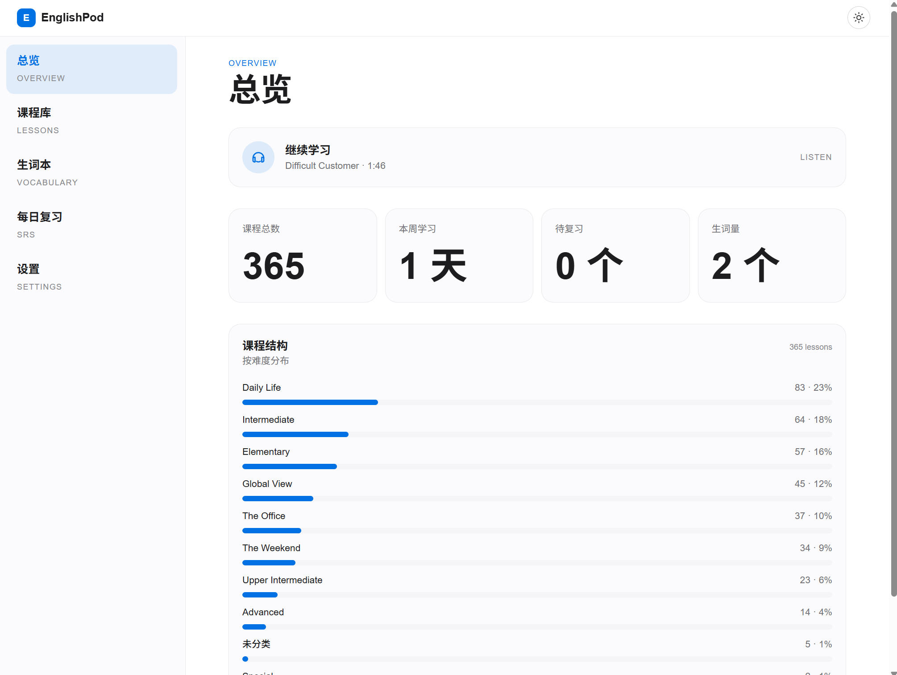
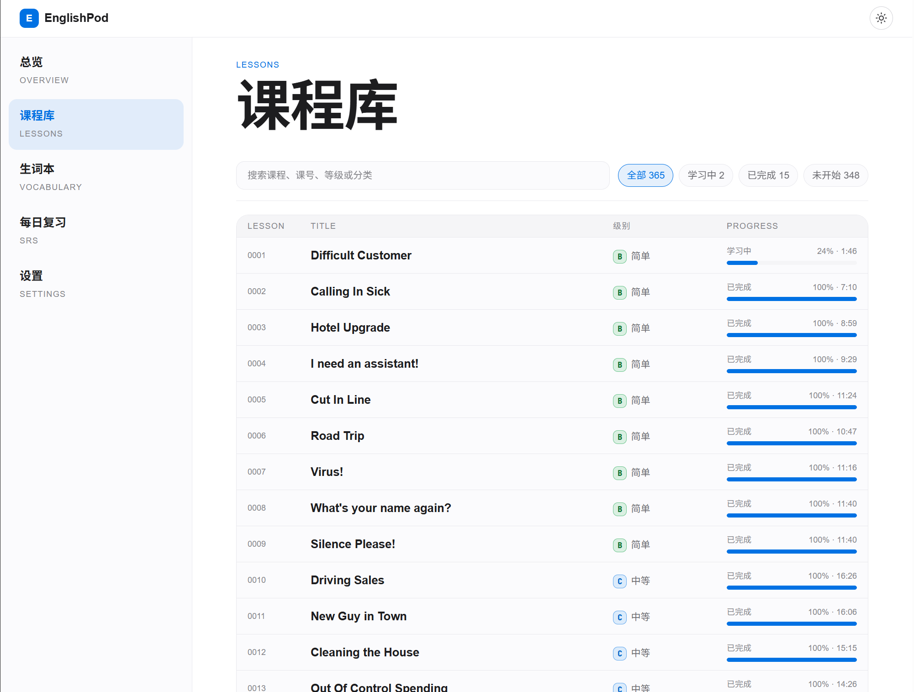
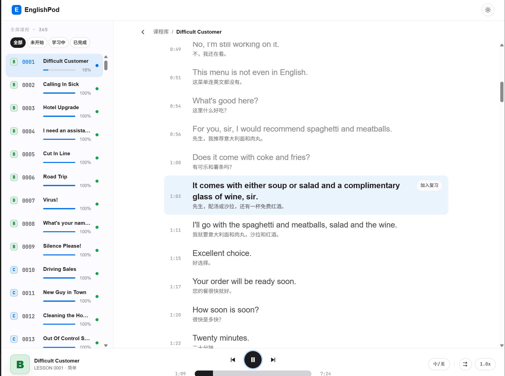
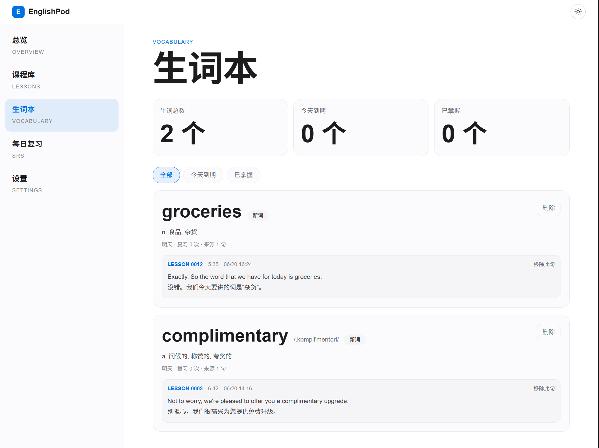

# EnglishPod

EnglishPod365 是一个面向英语学习者的在线学习网站，围绕 365 节 EnglishPod 课程提供沉浸式听力训练、同步字幕、划词翻译、生词收藏和每日复习，帮助用户从真实语境中持续积累词汇与听力能力。

EnglishPod365 is an online English learning website built around 365 EnglishPod lessons. It combines immersive listening practice, synchronized subtitles, word selection translation, vocabulary saving, and daily review to help learners build vocabulary and listening skills from real lesson context.


## 界面截图 / Screenshots

### 总览 / Dashboard



### 课程库 / Course Library



### 课程详情 / Lesson Detail



### 生词本 / Vocabulary



## 功能介绍

### 学习仪表盘

首页提供学习概览，包括课程总数、本周学习天数、待复习数量和生词量。应用会记录最近学习的课程与播放位置，用户可以从“继续学习”卡片回到上次的音频时间点。

### 课程库

课程库读取 `resource/course-list.json`，展示课程编号、标题、等级和学习状态。支持按课程标题、课号、等级或分类搜索，也支持按学习状态筛选，方便从 365 节课程中快速找到要学的内容。

### 沉浸式课程学习页

课程页包含课程侧栏、字幕区域和固定音频播放器。播放器支持播放进度记录、继续播放、速度控制和字幕模式切换；字幕区域会跟随音频时间高亮当前句，并支持点击句子跳转到对应时间点。

当前支持的字幕模式：

- `中英双语`：默认模式，适合初学者对照理解。
- `隐藏字幕`：纯听力训练模式。
- `仅中文`：用于快速确认含义。
- `仅英文`：用于强化英文输入。

### 单词查询与生词本

在课程字幕中点击英文单词，会弹出释义卡片，展示音标、词性和中文释义。用户可以把单词加入生词本，系统会记录来源课程、句子和时间点，方便之后回到真实语境中复习。

词典数据来自 `resource/dict/lookup.json` 和 `resource/dict/lemmas.json`。如果需要重新构建词典，可准备 `resource/dict/ecdict.mini.csv` 后运行构建脚本。

### 句子收藏与间隔复习

应用支持收藏句子与生词，并在复习页统一进入每日复习。复习卡片提供 `再来一次`、`困难`、`不错`、`简单` 等自评选项，系统会根据掌握程度安排下一次复习时间。复习数据目前保存在浏览器本地存储中，适合个人单机使用。

### 设置与本地数据

设置页支持明暗主题切换，并提供清空学习记忆功能。清空操作会删除课程学习进度、生词本和每日复习内容，但不会影响主题和字幕模式设置。

## 技术栈

- 前端：React 19、TypeScript、Vite、React Router、Tailwind CSS 4
- 后端：Node.js 原生 HTTP 服务
- 包管理：npm workspaces
- 数据来源：本地 `resource` 目录中的课程、字幕、音频、PDF 和词典资源

## 目录结构

```text
.
├── apps
│   ├── api              # Node.js API，提供课程列表、字幕、资源和词典查询
│   └── web              # React + Vite 前端应用
├── resource             # 课程资源、course-list.json、dict 词典数据
├── tools
│   ├── build-dict.mjs   # 从词典 CSV 构建 lookup/lemmas JSON
│   └── dev.mjs          # 同时启动 API 与 Web 开发服务
├── package.json         # workspace 脚本入口
└── PRD.md               # 产品需求文档
```

## 资源目录约定

API 默认从仓库根目录下的 `resource` 读取课程资源：

```text
resource
├── course-list.json
├── dict
│   ├── lookup.json
│   ├── lemmas.json
│   └── ecdict.mini.csv
└── 0001
    ├── dialog.mp3
    ├── lesson.mp3
    ├── review.mp3
    ├── subtitle.srt
    ├── subtitle.bilingual.srt
    ├── subtitle.zh.srt
    ├── transcript.txt
    ├── worksheet.pdf
    └── host.pdf
```

单课目录名需要是 4 位数字，例如 `0001`、`0365`。API 当前允许访问的课程文件包括：`dialog.mp3`、`lesson.mp3`、`review.mp3`、`worksheet.pdf`、`host.pdf`、`subtitle.srt`、`subtitle.bilingual.srt`、`subtitle.zh.srt` 和 `transcript.txt`。

如需使用自定义词典目录，可通过环境变量指定：

```bash
ENGLISHPOD_DICT_DIR=/path/to/dict
```

## 本地开发运行

### 1. 安装依赖

```bash
npm install
```

### 2. 准备课程资源

确认根目录存在 `resource/course-list.json`，并且每节课的资源文件放在对应的 4 位课程目录下。仓库已包含资源时可跳过这一步。

如果词典 JSON 不存在，可在准备好 `resource/dict/ecdict.mini.csv` 后运行：

```bash
node tools/build-dict.mjs
```

### 3. 启动开发环境

```bash
npm run dev
```

该命令会同时启动：

- API 服务：默认 `http://localhost:4173`
- Web 前端：Vite 默认开发地址，通常是 `http://localhost:5173`

打开 Vite 输出的 Web 地址即可访问应用。

也可以分别启动：

```bash
npm run dev:api
npm run dev:web
```

## 构建与预览

构建前端：

```bash
npm run build:web
```

本地预览前端产物：

```bash
npm run preview -w apps/web
```

启动 API：

```bash
npm run start:api
```

如需修改 API 端口：

```bash
PORT=4173 npm run start:api
```

Windows PowerShell 可使用：

```powershell
$env:PORT=4173; npm run start:api
```

## 一键启动

仓库提供了启动脚本与 Docker 配置，无需手动逐条执行命令。

### 脚本启动（推荐本地使用）

脚本会自动安装依赖、构建前端，并以单端口方式启动（API 同时托管前端），默认地址 `http://localhost:4173`。

Windows PowerShell：

```powershell
./start.ps1            # 生产模式，单端口 http://localhost:4173
./start.ps1 -Dev       # 开发模式，热更新（Web http://localhost:5173）
./start.ps1 -Port 8080 # 指定端口
```

Linux / macOS：

```bash
chmod +x start.sh      # 首次赋予执行权限
./start.sh             # 生产模式，单端口 http://localhost:4173
./start.sh --dev       # 开发模式，热更新
PORT=8080 ./start.sh   # 指定端口
```

也可以直接用 npm 脚本：

```bash
npm run serve   # 构建前端并以单端口启动服务
npm run start   # 已构建过前端时，直接启动服务
npm run dev     # 开发模式，热更新
```

### Docker 启动

镜像在构建阶段编译前端，运行阶段由 API 单进程同时托管前端与接口；课程资源 `resource` 目录通过挂载方式提供（不打入镜像）。

```bash
docker compose up -d --build
```

启动后访问 `http://localhost:4173`。

自定义端口：

```bash
PORT=8080 docker compose up -d --build   # 宿主机 8080 -> 容器 4173
```

也可以不使用 compose，直接构建并运行：

```bash
docker build -t englishpod .
docker run -d --name englishpod -p 4173:4173 -v "$(pwd)/resource:/app/resource:ro" englishpod
```

> 提示：词典数据（`resource/dict/lookup.json` 等）需在宿主机上提前构建好（见上文 `tools/build-dict.mjs`），容器会以只读方式读取 `resource` 目录。

## 部署运行

除上面的脚本与 Docker 方式外，也可以按传统 Node.js 服务部署。

### 方式一：单机服务器部署

1. 在服务器安装 Node.js 20 或更高版本。
2. 将项目代码和 `resource` 目录上传到服务器。
3. 在项目根目录执行 `npm install`。
4. 执行 `npm run build:web` 构建前端。
5. 执行 `PORT=4173 npm run start:api` 启动 API。
6. 使用 Nginx、Caddy 或其他静态服务托管 `apps/web/dist`。
7. 将 `/api/*` 反向代理到 `http://127.0.0.1:4173`。

Nginx 示例：

```nginx
server {
  listen 80;
  server_name example.com;

  root /opt/englishpod/apps/web/dist;
  index index.html;

  location /api/ {
    proxy_pass http://127.0.0.1:4173;
    proxy_set_header Host $host;
    proxy_set_header X-Real-IP $remote_addr;
  }

  location / {
    try_files $uri $uri/ /index.html;
  }
}
```

### 方式二：内网或本机长期运行

如果只是个人在本机或内网使用，可以直接运行：

```bash
npm run dev
```

或在构建后分别运行 API 与前端预览：

```bash
npm run start:api
npm run preview -w apps/web
```

## API 接口

当前 API 提供以下只读接口：

- `GET /api/health`：健康检查。
- `GET /api/courses`：读取课程列表。
- `GET /api/courses/:lessonId`：读取单节课程信息。
- `GET /api/courses/:lessonId/subtitles?mode=bilingual|off|zh|en`：读取并解析字幕。
- `GET /api/resources/:lessonId/:fileName`：读取课程音频、PDF、字幕或文本资源。
- `GET /api/dict/:word`：查询本地词典。

## 常用命令

```bash
npm run dev          # 同时启动 API 和 Web 开发服务
npm run dev:api      # 仅启动 API
npm run dev:web      # 仅启动 Web
npm run build:web    # 构建前端
npm run lint:web     # 检查前端代码
npm run test:api     # 运行 API 自检
npm run start:api    # 生产方式启动 API
```

## 当前限制

- 学习进度、生词本和复习计划保存在浏览器本地存储，换浏览器或清缓存后不会自动同步。
- 当前没有用户系统，适合个人自部署使用。
- AI 解析、PDF 内嵌阅读、跟读评分等能力在 `PRD.md` 中有规划，但 README 仅描述当前代码中可运行的核心功能。


